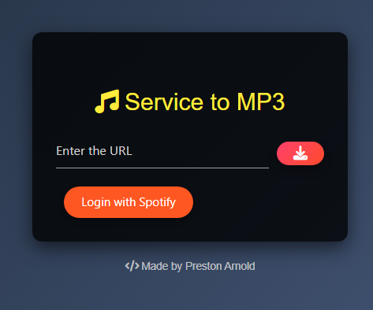
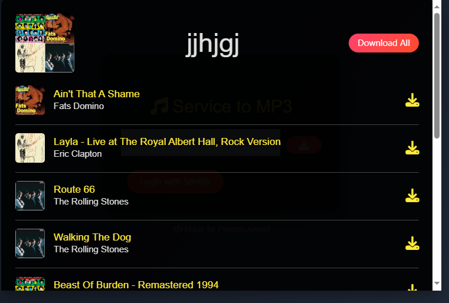

<div align="center">
  <h1>Cobalt Spotify</h1>
  <p>Enhance your Cobalt experience with Spotify track and playlist download support.</p>
  <br />
  <a href="#about"><strong>Explore Screenshots »</strong></a>
  <br />
  <a href="https://github.com/prestonarnold0/cobalt-spotify/issues/new?assignees=&labels=bug&template=01_BUG_REPORT.md&title=bug%3A+">Report a Bug</a>
  ·
  <a href="https://github.com/prestonarnold0/cobalt-spotify/issues/new?assignees=&labels=enhancement&template=02_FEATURE_REQUEST.md&title=feat%3A+">Request a Feature</a>
</div>

---

## About

Cobalt Spotify adds Spotify track and playlist download capabilities to Cobalt.

<details>
<summary>📸 Screenshots</summary>
<br />

|           **Main Page**            |             **Playlist Modal**              |
| :--------------------------------: | :-----------------------------------------: |
|  |  |

</details>

### Built With

- **Express**: For server-side functionality.
- **EJS**: For templating.

## Getting Started

### Installation

To get started with Cobalt Spotify:

1. Clone the repository:

   ```bash
   git clone https://github.com/prestonarnold0/cobalt-spotify.git
   ```

2. Navigate to the project directory and install dependencies:

   ```bash
   yarn
   # or
   npm install
   ```

3. Copy the `.env.example` file to `.env` and fill in the required configuration.

### Usage

To start the development server, run:

```bash
yarn dev
# or
npm run dev
```

## Roadmap

Check out the [open issues](https://github.com/prestonarnold0/cobalt-spotify/issues) for a list of proposed features and known issues.

- [Top Feature Requests](https://github.com/prestonarnold0/cobalt-spotify/issues?q=label%3Aenhancement+is%3Aopen+sort%3Areactions-%2B1-desc) (Vote with 👍)
- [Top Bugs](https://github.com/prestonarnold0/cobalt-spotify/issues?q=is%3Aissue+is%3Aopen+label%3Abug+sort%3Areactions-%2B1-desc) (Vote with 👍)
- [Newest Bugs](https://github.com/prestonarnold0/cobalt-spotify/issues?q=is%3Aopen+is%3Aissue+label%3Abug)

## Support

For support, please use the following resources:

- [GitHub Issues](https://github.com/prestonarnold0/cobalt-spotify/issues/new?assignees=&labels=question&template=04_SUPPORT_QUESTION.md&title=support%3A+)

## Contributing

We welcome contributions from the community! Please read our [contribution guidelines](docs/CONTRIBUTING.md) before getting started. Your input helps make Cobalt Spotify better for everyone.

## License

This project is licensed under the [MIT License](LICENSE).

---

```

```
